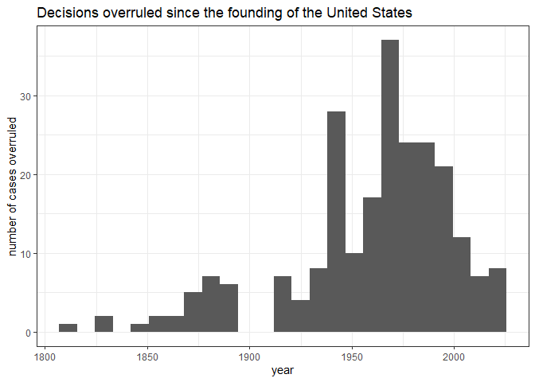

Are Supreme Court decisions being increasingly overturned?
================
fboulnois
2022-05-03

## Summary

Based on the news that the Supreme Court will [likely overturn abortion
rights](https://www.politico.com/news/2022/05/02/supreme-court-abortion-draft-opinion-00029473),
I began wondering how often previous rulings are overturned. I was also
curious whether there was trend of an increasing number of cases being
overruled in the last few decades, perhaps due to polarization or for
other reasons.

The short answer is that in the last two decades, rulings have not been
overturned very often, and there does not seem to be a trend in either
direction.

## Downloading the data

Luckily for us, [Congress provides a
table](https://constitution.congress.gov/resources/decisions-overruled/)
of all of the previous decisions overruled by subsequent decisions!

The first step is thus to download this table locally as a CSV.

## Loading and cleaning the data

Next, this data is loaded into R using the `data.table` library. The
columns are renamed to somewhat simplify grouping and aggregation.

``` r
dt <- fread("Table of Supreme Court Decisions Overruled by Subsequent Decisions Resources Constitution Annotated Congress.gov Library of Congress.csv")
setnames(dt, c("id", "overruling_decision", "year_of_overruling_decision", "overruled_decision", "years_of_overruled_decisions"))
head(dt)
```

    ##    id
    ## 1:  1
    ## 2:  3
    ## 3:  2
    ## 4:  4
    ## 5:  5
    ## 6:  8
    ##                                                            overruling_decision
    ## 1:                         Ramos v. Louisiana,No. 18-5924 (U.S. Apr. 20, 2020)
    ## 2:                          Herrera v. Wyoming, No. 17-532 (U.S. May 20, 2019)
    ## 3: Franchise Tax Board of California v. Hyatt, No. 17-1299 (U.S. May 13, 2019)
    ## 4:                 Knick v. Township of Scott, No. 17-647 (U.S. June 21, 2019)
    ## 5:                      Rucho v. Common Cause, No. 18-422 (U.S. June 27, 2019)
    ## 6:                              Trump v. Hawaii,No. 17-965 (U.S. June 26,2018)
    ##    year_of_overruling_decision
    ## 1:                        2020
    ## 2:                        2019
    ## 3:                        2019
    ## 4:                        2019
    ## 5:                        2019
    ## 6:                        2018
    ##                                                                                                             overruled_decision
    ## 1: Apodaca v. Oregon,406 U.S. 404 (1972) (plurality opinion);Johnson v. Louisiana,406 U.S. 366 (1972) (Powell, J., concurring)
    ## 2:                                                                                      Ward v. Race Horse,163 U.S. 504 (1896)
    ## 3:                                                                                         Nevada v. Hall, 440 U.S. 410 (1979)
    ## 4:              Williamson County Regional Planning Commission v. Hamilton Bank of Johnson City, 473 U.S. 172 (1985) (in part)
    ## 5:                                                                                      Davis v. Bandemer, 478 U.S. 109 (1986)
    ## 6:                                                                              Korematsu v. United States,323 U.S. 214 (1944)
    ##    years_of_overruled_decisions
    ## 1:                         1972
    ## 2:                         1896
    ## 3:                         1979
    ## 4:                         1985
    ## 5:                         1986
    ## 6:                         1944

One issue with this table is that when there are two or more years in
the `years_of_overruled_decisions` column then these are squished
together, so that `1967 1992` becomes `19671992`. This is relatively
easy to fix. The column is extracted as strings, split into groups of 4
digits using a function from the `stringr` package, and stored back as
numeric values. The end result is that the column contains arrays, but
these are still easy to work with.

``` r
dt[, years_of_overruled_decisions := lapply(str_extract_all(years_of_overruled_decisions, "\\d{4}"), as.numeric)]
```

Another issue is that `’` characters are read strangely as `’`. Let’s
replace those with regular `'` characters instead.

``` r
dt[, overruling_decision := str_replace_all(overruling_decision, "’", "'")]
dt[, overruled_decision := str_replace_all(overruled_decision, "’", "'")]
```

## Exploring the data

In which years were most decisions overturned? Let’s create a `ggplot2`
histogram and find out:

``` r
ggplot(data = dt, aes(year_of_overruling_decision)) +
  geom_histogram(bins = 25) +
  ggtitle("Decisions overruled since the founding of the United States") +
  xlab("year") +
  ylab("number of cases overruled") +
  theme_bw()
```

<!-- -->

Based on the histogram, most decisions were overruled by subsequent
decisions around the 1940s and 1970s, and the last two decades have been
relatively quiet by comparison.

The answer to the earlier questions is thus **no**, overall there has
not been an increasing number of Supreme Court decisions overruled by
later decisions in the last two decades.

### 1940s

So, what were the important cases that overturned previous decisions in
the 1940s? Let’s take a look:

``` r
dt[year_of_overruling_decision >= 1935 & year_of_overruling_decision <= 1945, overruling_decision]
```

    ##  [1] "United States v. South-Eastern Underwriters Ass'n,322 U.S. 533  (1944)"               
    ##  [2] "Mercoid Corp. v. Mid-Continent Co.,320 U.S. 661  (1944)"                              
    ##  [3] "Mahnich v. Southern Steamship Co.,321 U.S. 96  (1944)"                                
    ##  [4] "Federal Power Commssion v. Hope Natural Gas Co.,320 U.S. 591  (1944)"                 
    ##  [5] "Smith v. Allwright,321 U.S. 649  (1944)"                                              
    ##  [6] "Oklahoma Tax Commission v. United States,319 U.S. 598  (1943)"                        
    ##  [7] "Brady v. Roosevelt Steamship, Co.,317 U.S. 575  (1943)"                               
    ##  [8] "West Virginia State Board of Education v. Barnette,319 U.S. 624  (1943)"              
    ##  [9] "Jones v. Opelika, 319 U.S. 103 (1943) (re-argument)"                                  
    ## [10] "Murdock v. Pennsylvania,319 U.S. 105 (1943)"                                          
    ## [11] "Williams v. North Carolina,317 U.S. 287  (1942)"                                      
    ## [12] "Graves v. Schmidlapp,315 U.S. 657  (1942)"                                            
    ## [13] "State Tax Commission v. Aldrich,316 U.S. 174  (1942)"                                 
    ## [14] "Edwards v. California,314 U.S. 160  (1941)"                                           
    ## [15] "United States v. Chicago, Milwaukee, St. Paul & Pacific Railroad,312 U.S. 592  (1941)"
    ## [16] "Nye v. United States,313 U.S. 33  (1941)"                                             
    ## [17] "Toucey v. New York Life Insurance Co.,314 U.S. 118  (1941)"                           
    ## [18] "California v. Thompson,313 U.S. 109  (1941)"                                          
    ## [19] "Olsen v. Nebraska ex rel. Western Reference & Bond Ass'n,313 U.S. 236  (1941)"        
    ## [20] "United States v. Darby,312 U.S. 100  (1941)"                                          
    ## [21] "Alabama v. King & Boozer,314 U.S. 1  (1941)"                                          
    ## [22] "Tigner v. Texas,310 U.S. 141  (1940)"                                                 
    ## [23] "Helvering v. Hallock,309 U.S. 106  (1940)"                                            
    ## [24] "Madden v. Kentucky,309 U.S. 83  (1940)"                                               
    ## [25] "Rochester Telephone Corp. v. United States,307 U.S. 125  (1939)"                      
    ## [26] "O'Malley v. Woodrough,307 U.S. 277  (1939)"                                           
    ## [27] "Graves v. New York ex rel. O'Keefe,306 U.S. 466  (1939)"                              
    ## [28] "Erie Railroad v. Tompkins,304 U.S. 64  (1938)"                                        
    ## [29] "Helvering v. Mountain Producers Corp.,303 U.S. 376  (1938)"                           
    ## [30] "West Coast Hotel Co. v. Parrish,300 U.S. 379  (1937)"

Cross-referencing this list with Wikipedia, there are a few landmark
cases:

-   [Erie Railroad v. Tompkins
    (1938)](https://en.wikipedia.org/wiki/Erie_Railroad_Co._v._Tompkins):
    There is no general federal common law, and federal courts must
    apply state law to lawsuits between parties from different states
    that involve no federal questions.
-   [Edwards v. California
    (1941)](https://en.wikipedia.org/wiki/Edwards_v._California): A
    state cannot prohibit indigent people from moving into it.
-   [West Virginia State Board of Education v. Barnette
    (1943)](https://en.wikipedia.org/wiki/West_Virginia_State_Board_of_Education_v._Barnette):
    The Free Speech clause of the First Amendment prohibits public
    schools from forcing students to salute the American flag and say
    the Pledge of Allegiance.
-   [Smith v. Allright
    (1944)](https://en.wikipedia.org/wiki/Smith_v._Allwright): States
    may not permit or conduct primary elections which discriminate on
    the basis of race and these elections must be open to voters of all
    races.

There is no unifying theme in these cases and they are all interesting
in their own right.

### 1970s

How about in the 1970s? What were the important cases that overturned
previous decisions?

``` r
dt[year_of_overruling_decision >= 1965 & year_of_overruling_decision <= 1975, overruling_decision]
```

    ##  [1] "United States v. Reliable Transfer Co.,421 U.S. 397  (1975)"                                
    ##  [2] "Taylor v. Louisiana,419 U.S. 522  (1975)"                                                   
    ##  [3] "Edelman v. Jordan,415 U.S. 651  (1974)"                                                     
    ##  [4] "Lehnhausen v. Lake Shore Auto Parts Co.,410 U.S. 356  (1973)"                               
    ##  [5] "North Dakota State Board of Pharmacy v. Snyder's Drug Stores, Inc.,414 U.S. 156  (1973)"    
    ##  [6] "Braden v. 30th Judicial Circuit Court,410 U.S. 484  (1973)"                                 
    ##  [7] "Miller v. California,413 U.S. 15  (1973)"                                                   
    ##  [8] "Andrews v. Louisville & Nashville Railroad Co.,406 U.S. 320  (1972)"                        
    ##  [9] "Blonder-Tongue Laboratories, Inc. v. University of Illinois Foundation,402 U.S. 313  (1971)"
    ## [10] "Griffin v. Breckenridge,403 U.S. 88  (1971)"                                                
    ## [11] "Perez v. Campbell,402 U.S. 637  (1971)"                                                     
    ## [12] "Moragne v. States Marine Lines,398 U.S. 375  (1970)"                                        
    ## [13] "Williams v. Florida,399 U.S. 78  (1970)"                                                    
    ## [14] "Price v. Georgia,398 U.S. 323  (1970)"                                                      
    ## [15] "Ashe v. Swenson,397 U.S. 436  (1970)"                                                       
    ## [16] "Boys Markets, Inc. v. Retail Clerk's Union,398 U.S. 235  (1970)"                            
    ## [17] "Jones v. Alfred H. Mayer Co.,392 U.S. 409  (1969)"                                          
    ## [18] "Brandenburg v. Ohio,395 U.S. 444  (1969)"                                                   
    ## [19] "Benton v. Maryland,395 U.S. 784  (1969)"                                                    
    ## [20] "Moore v. Ogilvie,394 U.S. 814  (1969)"                                                      
    ## [21] "Lear, Inc. v. Adkins,395 U.S. 653  (1969)"                                                  
    ## [22] "Chimel v. California,395 U.S. 752  (1969)"                                                  
    ## [23] "Duncan v. Louisiana,391 U.S. 145  (1968)"                                                   
    ## [24] "Peyton v. Rowe,391 U.S. 54  (1968)"                                                         
    ## [25] "Lee v. Florida,392 U.S. 378  (1968)"                                                        
    ## [26] "Bruton v. United States,391 U.S. 123  (1968)"                                               
    ## [27] "Carafas v. LaVallee,391 U.S. 234  (1968)"                                                   
    ## [28] "Warden, Maryland Penitentiary v. Hayden,387 U.S. 294  (1967)"                               
    ## [29] "Keyishian v. Board of Regents,385 U.S. 589  (1967)"                                         
    ## [30] "Afroyim v. Rusk,387 U.S. 253  (1967)"                                                       
    ## [31] "Camara v. Municipal Court of San Francisco,387 U.S. 523  (1967)"                            
    ## [32] "Spevack v. Klein,385 U.S. 511  (1967)"                                                      
    ## [33] "Katz v. United States,389 U.S. 347  (1967)"                                                 
    ## [34] "Marchetti v. United States,390 U.S. 39  (1968)"                                             
    ## [35] "Harper v. Virgina Board of Elections,383 U.S. 663  (1966)"                                  
    ## [36] "Miranda v. Arizona,384 U.S. 436  (1966)"                                                    
    ## [37] "Pointer v. Texas,380 U.S. 400  (1965)"                                                      
    ## [38] "United States v. Brown,381 U.S. 437  (1965)"                                                
    ## [39] "Harris v. United States,382 U.S. 162  (1965)"                                               
    ## [40] "Swift & Co. v. Wickham,382 U.S. 111  (1965)"

Once again, cross-referencing this list with Wikipedia, there are a few
landmark cases:

-   [Miranda v. Arizona
    (1966)](https://en.wikipedia.org/wiki/Miranda_v._Arizona): The Fifth
    Amendment right against self incrimination requires suspects to be
    informed of their rights to remain silent and to obtain an attorney
    by law enforcement. This is where the concept of Miranda warnings or
    Mirandizing comes from!
-   [Harper v. Virginia State Board of Elections
    (1966)](https://en.wikipedia.org/wiki/Harper_v._Virginia_State_Board_of_Elections):
    Poll taxes violate the Equal Protection Clause of the Fourteenth
    Amendment.
-   [Katz v. United States
    (1967)](https://en.wikipedia.org/wiki/Katz_v._United_States): The
    Fourth Amendment’s protection from unreasonable search and seizure
    extends to any area where a person has a “reasonable expectation of
    privacy”.
-   [Afroyim v. Rusk
    (1967)](https://en.wikipedia.org/wiki/Afroyim_v._Rusk): A person’s
    U.S. citizenship may not be revoked unless they voluntarily
    relinquish it.
-   [Brandenburg v. Ohio
    (1969)](https://en.wikipedia.org/wiki/Brandenburg_v._Ohio): Unless
    speech is intended and likely to incite or produce imminent lawless
    action, the First Amendment protects the abstract advocacy of
    violence and of violating the law.
-   [Jones v. Alfred H. Mayer
    Co. (1968)](https://en.wikipedia.org/wiki/Jones_v._Alfred_H._Mayer_Co.):
    Congress may regulate the sale of private property to prevent racial
    discrimination.
-   [Miller v. California
    (1973)](https://en.wikipedia.org/wiki/Miller_v._California):
    Obscenity was redefined from that which is “utterly without social
    redeeming value” to that which lacks “serious literary, artistic,
    political, or scientific value”. It codified the Miller test, also
    known as the three-prong obscenity test, where a work can only be
    considered obscene if **all three** conditions are satisfied.
-   [Taylor v. Louisiana
    (1975)](https://en.wikipedia.org/wiki/Taylor_v._Louisiana): Women
    cannot be systematically excluded from the jury pool.

Two of the cases (Brandenburg and Miller) are arguably now considered
bedrock First Amendment cases. It is also interesting to see that cases
of discrimination against minorities and women became more prominent
(Harper, Jones, and Taylor).

### 2000s

How about since the year 2000? How many decisions have been overruled?

``` r
ggplot(data = dt[year_of_overruling_decision >= 2000, ], aes(year_of_overruling_decision)) +
  geom_histogram(bins = 20) +
  ggtitle("Decisions overruled since the year 2000") +
  xlab("year") +
  ylab("number of cases overruled") +
  theme_bw()
```

<!-- -->

``` r
dt[year_of_overruling_decision >= 2000, .N, by = year_of_overruling_decision][, sum(N)]
```

    ## [1] 27

There are no clear patterns, but overall 27 decisions have been
overruled since the year 2000. In other words, in the past two decades
fewer decisions have been overturned than the 10 year periods from 1935
to 1945 or 1965 to 1975.

### Other curiosities

What was the longest standing decision before being overturned?

``` r
dt[, max_standing_years := year_of_overruling_decision - vapply(years_of_overruled_decisions, min, numeric(1))]
dt[which.max(max_standing_years), ]
```

    ##    id                                          overruling_decision
    ## 1: 47 Exxon Corp. v. Central Gulf Lines, Inc.,500 U.S. 603  (1991)
    ##    year_of_overruling_decision                              overruled_decision
    ## 1:                        1991 Minturn v. Maynard,58 U.S. (17 How.) 477 (1855)
    ##    years_of_overruled_decisions max_standing_years
    ## 1:                         1855                136

Exxon Corp. v. Central Gulf Lines, Inc. (1991) overturned Minturn v.
Maynard (1855) which stood for 136 years!

The case was related to a marine fuel requirements contract in which one
of the parties filed for bankruptcy and never paid the full bill amount.
The court ruled unanimously that modern principles of admiralty
jurisdiction over contracts were incompatible with the previous
contractual principles defined in Minturn, and so Minturn was overruled.

What about the shortest standing decision?

``` r
dt[, min_standing_years := year_of_overruling_decision - vapply(years_of_overruled_decisions, max, numeric(1))]
dt[which.min(min_standing_years), ]
```

    ##    id                        overruling_decision year_of_overruling_decision
    ## 1: 72 United States v. Ross,456 U.S. 798  (1982)                        1982
    ##                           overruled_decision years_of_overruled_decisions
    ## 1: Robbins v. California,453 U.S. 420 (1981)                         1981
    ##    max_standing_years min_standing_years
    ## 1:                  1                  1

United States v. Ross (1982) overruled Robbins v. California (1981) in
just one year!

In Robbins, the Supreme Court stated that the Fourth Amendment provides
protection to the owner of every container that conceals its contents
from plain view. But in Ross, the court found that there is a motor
vehicle exception to this rule which allows law enforcement to search
containers found in a vehicle (in this case the trunk) if they already
have probable cause to perform a legal warrantless search of the
automobile.

## Conclusions

Many decisions were overruled by subsequent decisions around the 1940s
and 1970s, and few Supreme Court decisions have been overruled in the
last two decades. The longest standing decision before being overturned
stood for 136 years, and the shortest only one year.

Although the `data.table`, `stringr`, and `ggplot2` R packages are
overkill for this analysis they also make it really easy. I find these
packages indispensable to consistently and cohesively address more
challenging data problems.
